# Lab 1: Migrating Taxi data to Amazon DynamoDB and Amazon Aurora using AWS DMS

- [Overview](#overview)
- [High Level Architecture](#high-level-architecture)
- [Preparing the Environment](#preparing-the-environment)
- [Creating Endpoints for Source and Target databases](#creating-endpoints-for-source-and-target-databases)
  * [Create a Source endpoint for Oracle RDS](#create-a-source-endpoint-for-oracle-rds)
  * [Create a Target endpoint for Aurora PostgreSQL](#create-a-target-endpoint-for-aurora-postgresql)
  * [Create a Target endpoint for Amazon DynamoDB](#create-a-target-endpoint-for-amazon-dynamodb)
- [Migrate data from Oracle source to DynamoDB target](#migrate-data-from-oracle-source-to-dynamodb-target)
  * [Creating Replication Task for DynamoDB Migration](#creating-replication-task-for-dynamodb-migration)
  * [Modify Replication Task for DynamoDB](#modify-replication-task-for-dynamodb)
  * [Monitoring Replication Task for DynamoDB](#monitoring-replication-task-for-dynamodb)
- [Migrate data from Oracle source to Aurora PostgreSQL target](#migrate-data-from-oracle-source-to-aurora-postgresql-target)
  * [Creating Replication Task for Aurora Migration](#creating-replication-task-for-aurora-migration)
  * [Monitoring Replication Task for Aurora PostgreSQL](#monitoring-replication-task-for-aurora-postgresql)
- [Final Validation of DMS Tasks](#final-validation-of-dms-tasks)

## Overview

[AWS DMS](https://aws.amazon.com/dms/) (Database Migration Service) helps you migrate databases to AWS quickly and securely.
In this lab, you will be performing a migration of sample taxi application data from RDS Oracle to Amazon DynamoDB and Amazon Aurora PostgreSQL databases. For this lab, we have created a typical relational schema with foreign key dependencies between tables. We have used sample trip data (green taxi-Jan 2016) from [AWS Open dataset registry](https://registry.opendata.aws/nyc-tlc-trip-records-pds/) to populate trips table.


## High Level Architecture 

As part of this lab, we will migrate the **Trips** table  which is used by trips booking and management application to DynamoDB.  The application will store the data as a key-value schema and leverage the automatic scaling, flexible schema, serverless characteristics of DynamoDB for better scalability, availability and performance. 

In DynamoDB you work with tables, items, and attributes that are the core components. A table is a collection of items and each item is a collection of attributes. DynamoDB uses primary keys called partition keys to uniquely identify each item in a [table](https://docs.aws.amazon.com/amazondynamodb/latest/developerguide/HowItWorks.CoreComponents.html). You can also use [secondary indexes](https://docs.aws.amazon.com/amazondynamodb/latest/developerguide/SecondaryIndexes.html) to provide more querying flexibility. For this lab, we have created a DynamoDB table namely [aws-db-workshop-trips](./assets/ddb.png) with a partition\_key (_riderid_) and sort\_key (_tripinfo_) which uniquely identifies the trip data. We will also create a secondary index on _driverid_ so that the application can query the table using both _riderid_ as well as _driverid_.


For billing and payment use cases, we will migrate the **Billing**, **Riders**, **Drivers** and **Payment** tables to Aurora PostgreSQL. Amazon Aurora combines the performance and availability of traditional enterprise databases with the simplicity and cost-effectiveness of open source databases. The billing and payment application will leverage the ACID, transactional and analytics capabilities of [PostgreSQL](https://aws.amazon.com/rds/aurora/postgresql-features/). Using Aurora, we can scale the read traffic by adding additional replicas as needed. The figure below depicts the high level deployment architecture.  
 

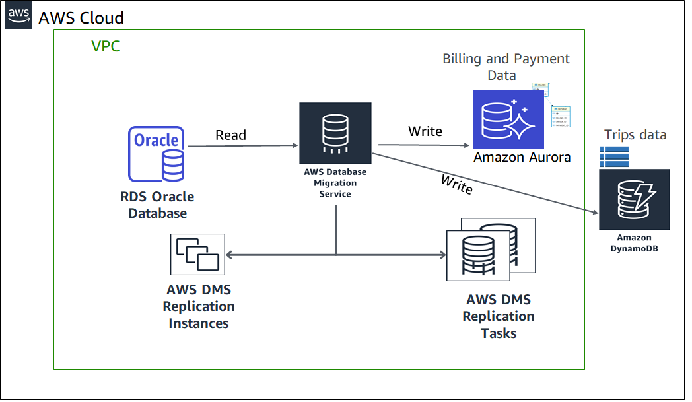

## Preparing the Environment

1.  Check if the CloudFormation Stack has successfully created the AWS resources. Go to [CloudFormation](https://us-east-1.console.aws.amazon.com/cloudformation/home?region=us-east-1#). You will see two Stacks created as shown below.  Click on the **Stack** that is created with the name **mod-**. This is a parent stack. The Stack with the name **aws-cloud9-xx** is a child stack and is used for launching Cloud9 environment. Click the parent stack and look at the **Outputs** section. We suggest to copy paste all the output values in a notepad. These details will be used in the subsequent steps as well as in Lab 2 and Lab 3.

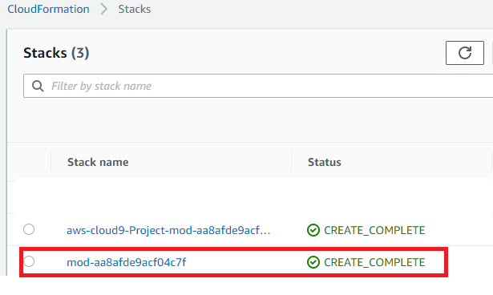

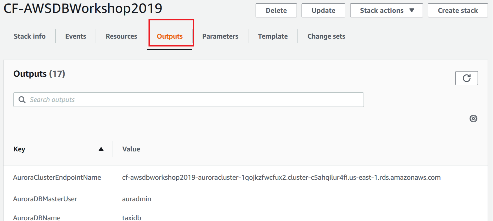


2. **Optional Step** Test the connectivity to RDS Oracle from your laptop using SQL client. You may want to explore the source Oracle schema by running some sample queries using SQL client of your choice. Alternatively, you can also explore the source relational schema [data model](./assets/taxi-data-model.png) and [sample output](./assets/oracle-taxi-schema.txt). Sample query output from source Oracle database schema are given below for your reference.

Use the following information to connect to the RDS Oracle database.

|Parameter|Description|
|-------------|--------------|
|Server name | Enter the Oracle RDS DNS value shown in parent CloudFormation stack output|
|Port | 1521|
|Username | dbadmin|
|Password| oraadmin123|
|SID| ORCL|
    
```sql
SELECT OWNER,OBJECT_TYPE, Count(*) FROM DBA_OBJECTS WHERE OWNER IN ('TAXI') GROUP BY OWNER,OBJECT_TYPE;
OWNER OBJECT_TYPE  COUNT(*)
 TAXI	TRIGGER	3
 TAXI	LOB	2
 TAXI	TABLE	11
 TAXI	SEQUENCE	5
 TAXI	INDEX	17

 Select count(*) from taxi.trips;
  Count(*) 
  128714 
```
         
3. We will leverage [AWS Cloud9](https://aws.amazon.com/cloud9/) IDE throughout this workshop for running scripts and deploying code, etc.

4. Open [Cloud9](https://us-east-1.console.aws.amazon.com/cloud9/home?region=us-east-1#) development environment which is created as part of the CloudFormation stack. Click on __Open IDE__.

    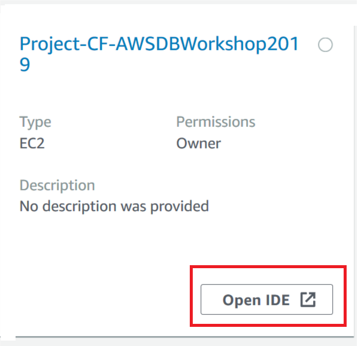

5. Open a terminal window in the AWS Cloud9 IDE by clicking on __Window__ from the menu bar on the top and select __New Terminal__. In the Cloud9 terminal, run the below command to clone the github repository.

 ```shell script
 cd ~/environment
 git clone https://github.com/aws-samples/amazon-rds-purpose-built-workshop.git
 ```

6. Install PostgreSQL client and related libraries in the Cloud9 environment. This is required to use the PostgreSQL command line utility psql.

```shell script
sudo yum install -y postgresql96 postgresql96-contrib postgresql96-devel 
```

7. Install [JQ](https://stedolan.github.io/jq/) in the Cloud9 environment. We will leverage **JQ** to slice and filter JSON data.

```shell script
cd ~/environment
sudo yum -y install jq gettext
```

8. Connect to target Aurora PostgreSQL using psql command as shown below in the Cloud9 terminal. For more options and commands, refer to [psql](https://www.postgresql.org/docs/9.6/app-psql.html) documentation.

Use the following information to connect to the Aurora PostgreSQL database.

|Parameter| Description|
|------|-------------
|Host Name | Enter the AuroraClusterEndpointName value shown in parent CloudFormation stack output|
|Port | 5432|
|Username | auradmin|
|Password| auradmin123|
|Database Name| taxidb| 

```shell script
psql -h <Host Name> -U <Username> -d <Database Name> -p <Port>
```

e.g. psql -h xxxxx.us-east-1.rds.amazonaws.com -U auradmin -d taxidb -p 5432

```shell script
\l #list the databases in PostgreSQL cluster 
```  

```shell script
\dn #list the schemas in the database 
``` 

```shell script
\d #list the tables in the public schema of the database
```   

```shell script
\q #quit
```  

> Note: As you have figured out, there are no tables created in Aurora PostgreSQL yet.
  
9. Please note that before we migrate data from Oracle RDS to Aurora PostgreSQL, we need to setup a target schema. We recommend to leverage [AWS SCT](https://docs.aws.amazon.com/SchemaConversionTool/latest/userguide/CHAP_Welcome.html) to migrate schema from Oracle to PostgreSQL. However, for this workshop, we have provided a converted schema to use in the target Aurora PostgreSQL environment.  Please execute the following command in the Cloud9 terminal to create the schema.
 
```shell script
    cd ~/environment/amazon-rds-purpose-built-workshop/
    psql -h <AuroraClusterEndpointName> -U auradmin -d taxidb -p 5432 -f ./src/create_taxi_schema.sql
```
   
You can verify if the tables are created by running the below command after logging via psql.

```shell script
\dt  #list the tables in the public schema of the database
\d trips #describe a table 
```

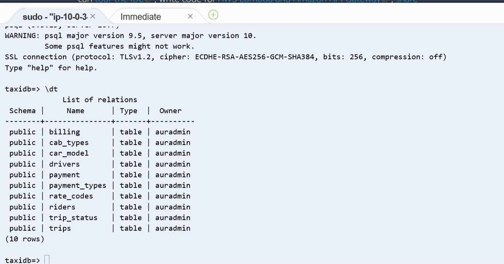

**Good Job!!** At this point, you have completed all the pre-requisites.  Please proceed to the data migration part.

## Creating Endpoints for Source and Target databases

Before we perform data migration using AWS DMS, we need to create endpoints for both source and target databases. This will be required for creating a migration task later in the workshop. 

Open the [AWS DMS console](https://us-east-1.console.aws.amazon.com/dms/home?region=us-east-1), and choose **Endpoints** in the navigation pane. 


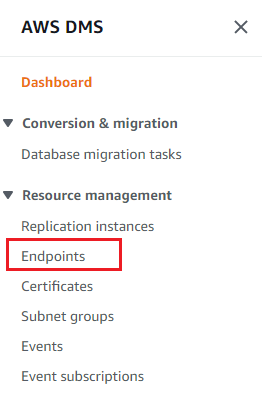

### Create a Source endpoint for Oracle RDS

Click **Create endpoint**. Enter the values as follows:

|Parameter|Description|
|-------------|--------------|
|Endpoint type | Select **Source endpoint**|
|Endpoint Identifier | Type a name, such as **`orasource`**|
|Source Engine | oracle|
|Server name | Enter the Oracle RDS DNS value shown in parent CloudFormation stack output|
|Port | 1521|
|Username | Enter as dbadmin|
|Password| Enter oraadmin123|
|SID| ORCL|

> **_NOTE:_** You can also choose the corresponding RDS instance by clicking the option "Select RDS DB Instance".


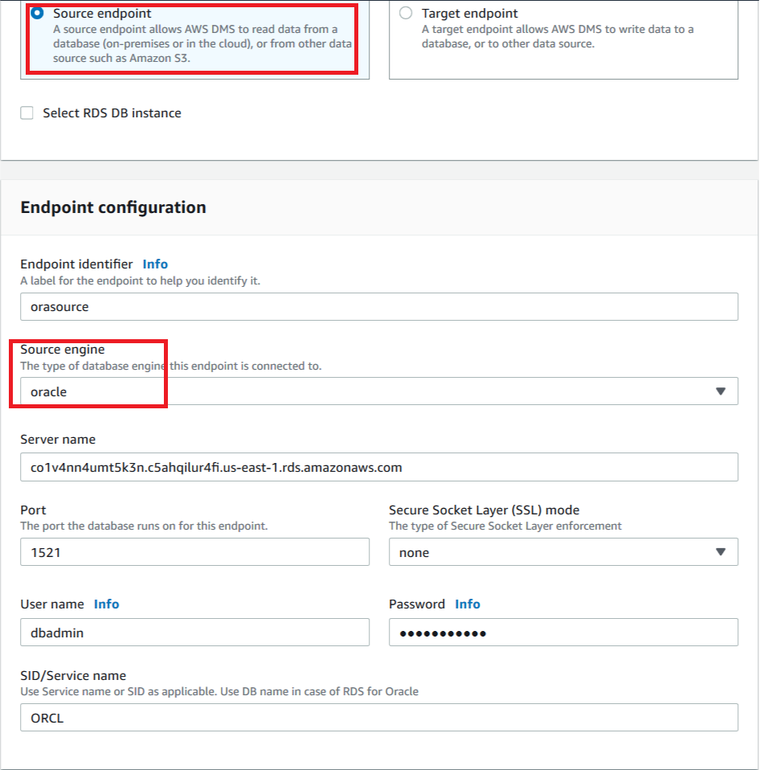 

Please leave the rest of the settings default. Make sure that the database name, port, and user information are correct.  Click **Create endpoint**.


After creating the endpoint, you should test the connection. Click on the endpoint and go to Connections Tab. Choose **Test connection** option. 
Choose the DMS instance created by the CloudFormation stack and click **Run Test**. The Status should return as successful after some time.


 

### Create a Target endpoint for Aurora PostgreSQL 

Click **Create endpoint**. Enter the values as follows:
 
|Parameter| Description|
|------|-------------
|Endpoint type | Select **Target endpoint**|
|Endpoint Identifier | Type a name, such as **`aurtarget`**|
|Target Engine | aurora-postgresql|
|Server name | Enter the AuroraClusterEndpointName value shown in parent CloudFormation stack output|
|Port | 5432|
|Username | Enter as auradmin|
|Password| Enter auradmin123|
|Database Name| taxidb| 
 
> **_NOTE:_** You can also choose the corresponding Aurora instance by clicking the option "Select RDS DB Instance".

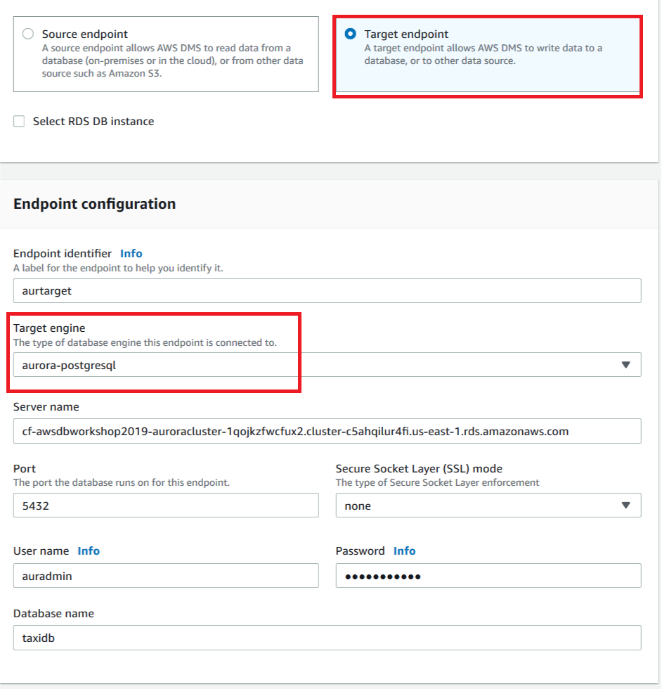 

Please leave the rest of the settings default. Make sure that the Aurora cluster DNS, database name, port, and user information are correct. Click **Create endpoint**.
 
After creating the endpoint, test the connection like you did earlier for the source endpoint. Click on the endpoint and go to Connections Tab. Choose **Test connection** option. 
Choose the DMS instance created by the CloudFormation stack and click Run Test. The Status should return as successful after some time.

 

### Create a Target endpoint for Amazon DynamoDB

Click **Create endpoint**. Enter the values as follows:
 
|Parameter| Description|
|------|---------------|
|Endpoint type | Select **Target endpoint**|
|Endpoint Identifier | Type a name, such as **`ddbtarget`**|
|Target Engine | dynamodb|
|Service access role ARN| Enter the IAM Role ARN (Note: Provide the value of DMSDDBRoleARN from CloudFormation Outputs section)|

 

Please leave the rest of the settings default. Make sure that the IAM Role ARN information is correct. Click **Create endpoint**.
  
After creating the endpoint, you should **test the connection** as shown below. Choose the DMS instance created by the CloudFormation stack.

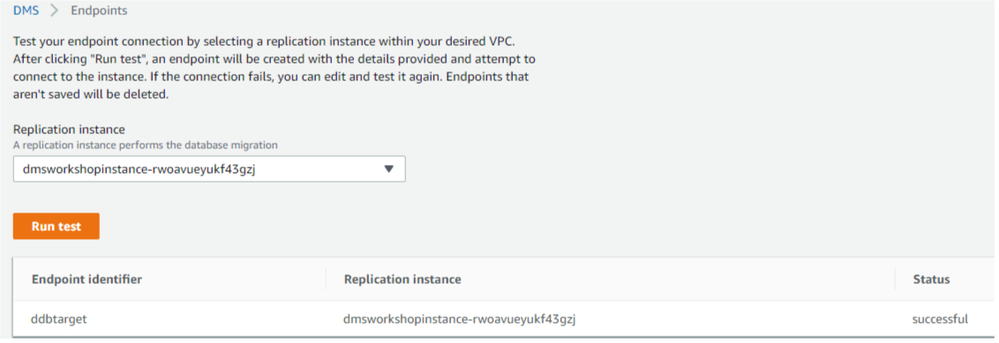 

## Migrate data from Oracle source to DynamoDB target 

### Creating Replication Task for DynamoDB Migration

Using an AWS DMS task, you can specify which schema to migrate and the type of migration. You can migrate existing data, migrate existing data and replicate ongoing changes, or replicate data changes only. In this lab, we will migrates existing data only. 

AWS DMS uses table-mapping rules to map data from the source to the target DynamoDB table. AWS DMS currently supports map-record-to-record and map-record-to-document as the only valid values for the rule-action parameter. For this lab, we will use map-record-to-record option to migrate trip data from Oracle to DynamoDB. Please refer to [DMS documentation](https://docs.aws.amazon.com/dms/latest/userguide/CHAP_Target.DynamoDB.html) for more details.

1. Open the [AWS DMS console](https://us-east-1.console.aws.amazon.com/dms/home?region=us-east-1), and choose **Database migration tasks** in the navigation pane. 

2. Click **Create task**

3. Task creation includes multiple sections. Under Task Configuration, enter below.
     
|Parameter| Description|
|------|---------|
|Task Identifier | Type a name, such as **`ora2ddb`**|
|Replication Instance| Choose the DMS instance created by the CloudFormation stack|
|Source database Endpoint| Choose orasource|
|Target database Endpoint | Choose ddbtarget|
|Migration Type| Choose Migrate existing data|
  
> **_NOTE:_** Typical production migration involves full load followed by continuous data capture CDC. This can be achieved by using choosing option Migrate existing data and replicate ongoing changes. For this lab, we will go with full load only.

4. Uncheck the option **Start task on create**. We will be modifying the task after it's created to speed up the migration.

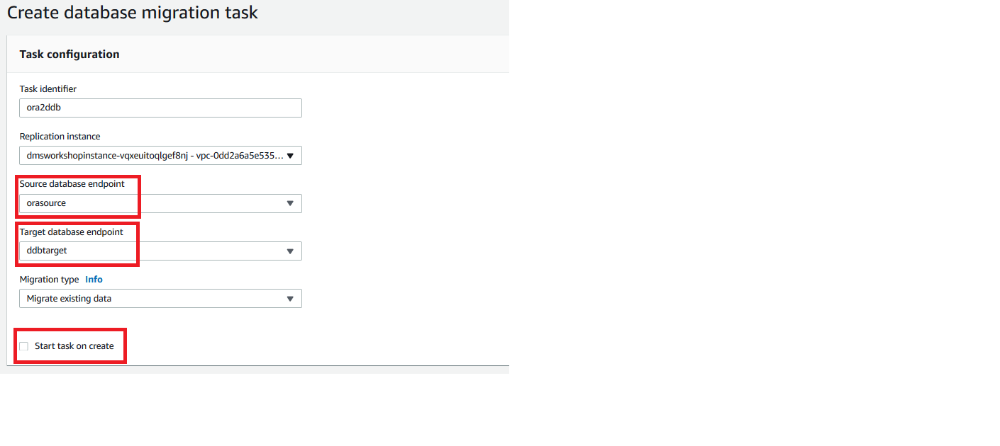


5. Under Task settings , enter as below
    - Target Table preparation mode  - Choose **Do Nothing**
    - Include LOB columns in replication - Choose **Limited LOB Mode**
    - Select **Enable CloudWatch Logs**

 

 6. Under Table Mapping section, enter as below:
 - choose **JSON Editor** and copy & paste the following mapping code.
  
```json
   {  
      "rules": [  
      {  
          "rule-type": "selection",  
          "rule-id": "1",  
          "rule-name": "1",  
          "object-locator": {  
          "schema-name": "TAXI",  
          "table-name": "TRIPS"  
      },  
          "rule-action": "include"  
      },  
      {  
          "rule-type": "object-mapping",  
          "rule-id": "2",  
          "rule-name": "2",  
          "rule-action": "map-record-to-record",  
          "object-locator": {  
          "schema-name": "TAXI",  
          "table-name": "TRIPS"  
      },  
      "target-table-name": "aws-db-workshop-trips",  
      "mapping-parameters": {  
      "partition-key-name": "riderid",  
      "sort-key-name": "tripinfo",  
      "attribute-mappings": [{  
          "target-attribute-name": "riderid",  
          "attribute-type": "scalar",  
          "attribute-sub-type": "string",  
          "value": "${RIDER_EMAIL}"  
      },  
      {  
          "target-attribute-name": "tripinfo",  
          "attribute-type": "scalar",  
          "attribute-sub-type": "string",  
          "value": "${PICKUP_DATETIME},${ID}"  
      },  
      {  
          "target-attribute-name": "driverid",  
          "attribute-type": "scalar",  
          "attribute-sub-type": "string",  
          "value": "${DRIVER_EMAIL}"  
      },  
      {  
          "target-attribute-name": "DriverDetails",  
          "attribute-type": "scalar",  
          "attribute-sub-type": "string",  
          "value": "{\"Name\":\"${DRIVER_NAME}\",\"Vehicle Details\":{\"id\":\"${VEHICLE_ID}\",\"type\":\"${CAB_TYPE_ID}\"}}"  
      }]  
      }  
      }  
      ]  
      }
 ```
   

> **_NOTE:_** As part of the migration task, we have created transformation rules to add few extra attributes from the original data. for e.g. RIDER_EMAIL as riderid (partition_key) and ID & PICKUP_DATETIME as tripinfo (sort key). This will ensure that our new design will able to uniquely identify the trip data by riderid. Also, we have combined many vehicle attributes and stored it as DriverDetails. In summary, this table stores all the rider and driver information in a de-normalized format.


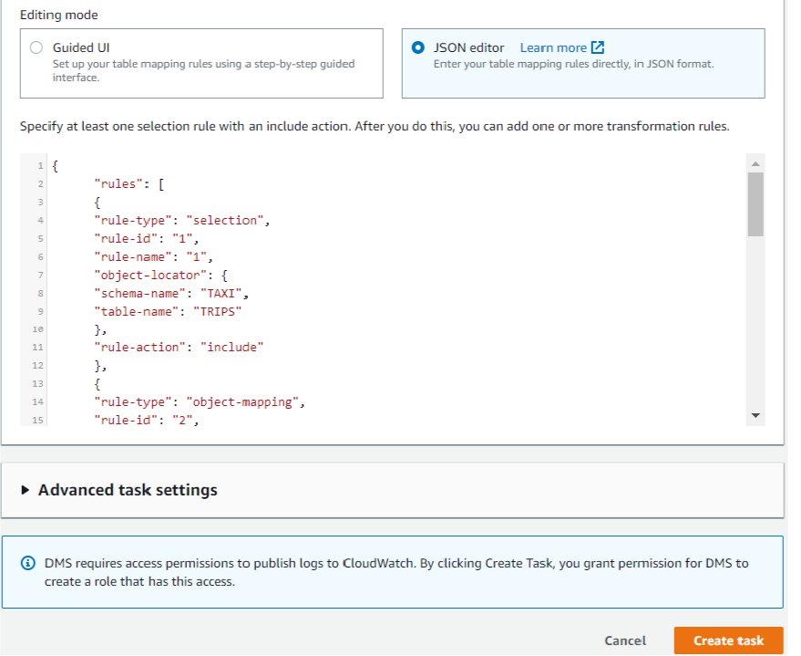 

 7. Do not modify anything in the Advanced settings.

 8. Click **Create task**. Wait for the task status to change from *Creating* to *Ready* in the DMS console.

### Modify Replication Task for DynamoDB

We will modify a few DMS level task settings (`ParallelLoadThreads` and `ParallelLoadBufferSize`) to speed up the migration from Oracle source to DynamoDB target and then manually start the task.

1. Execute the following command in Cloud9 terminal to set the DMS task ARN in a variable.

 ```shell script
 TASK_ARN=$(aws dms describe-replication-tasks --filters Name=replication-task-id,Values=ora2ddb | jq -r '.ReplicationTasks[].ReplicationTaskArn')
 ```

2. Modify the DMS task settings by running the following in the Cloud9 terminal.

 ```shell script
 aws dms modify-replication-task --replication-task-arn $TASK_ARN --replication-task-settings '{"TargetMetadata":{"ParallelLoadThreads": 8,"ParallelLoadBufferSize": 50}}'
 ```

3. Wait for the task status to change from *Modifying* to *Ready* in the DMS Console.

4. Start the DMS task by selecting it and choosing **Restart/Resume** from the **Actions** Menu.


### Monitoring Replication Task for DynamoDB 

After task is started, monitor the task by looking at the console as shown below. You can also look at the CloudWatch logs for more information.

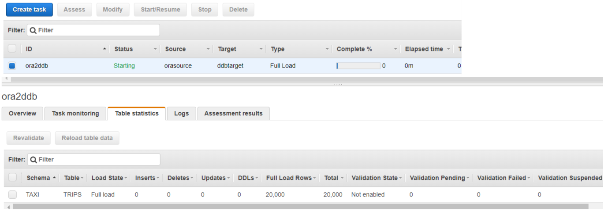 

> **_NOTE:_** This task will take 2 to 3 minutes to complete. After the full load, you will see 128,714 Rows are migrated.

## Migrate data from Oracle source to Aurora PostgreSQL target 

### Creating Replication Task for Aurora Migration

 Now, we will migrate four tables (Riders, Drivers, Payment and Billing) from RDS Oracle to Aurora PostgreSQL. We have already created those tables in Aurora PostgreSQL as part of the environment setup.

 1. Open the [AWS DMS console](https://us-east-1.console.aws.amazon.com/dms/home?region=us-east-1), and choose **database migration tasks** in the navigation pane. 

 2. Click **Create task**.

 3. Database Migration Task creation includes multiple sections. Under Task Configuration, enter below.
     
    |Parameter| Description|
    |------|----------------|
    |Task Identifier | Type a name, such as **`ora2aurora`**|
    |Replication Instance| Choose the DMS instance created by CloudFormation|
    |Source database Endpoint| Choose orasource|
    |Target database Endpoint | Choose aurtarget|
    |Migration Type| Choose Migrate existing data|
  
 4. Click **Start task on create**

 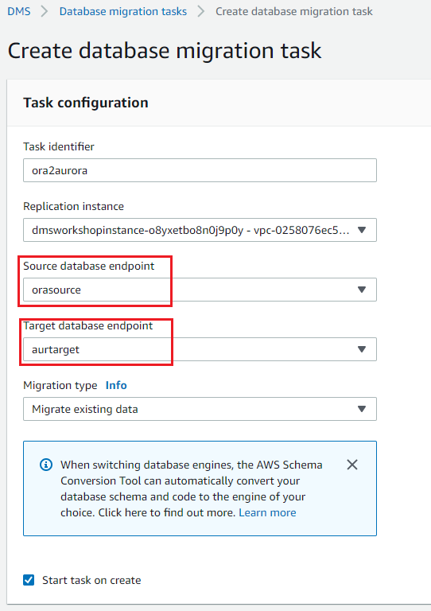 

 5. Under Task settings , enter as below
    - Target Table preparation mode  - Choose **Do Nothing**
    - Include LOB columns in replication - Choose **Limited LOB Mode**
    - Select **Enable validation**
    - Select **Enable CloudWatch Logs**

 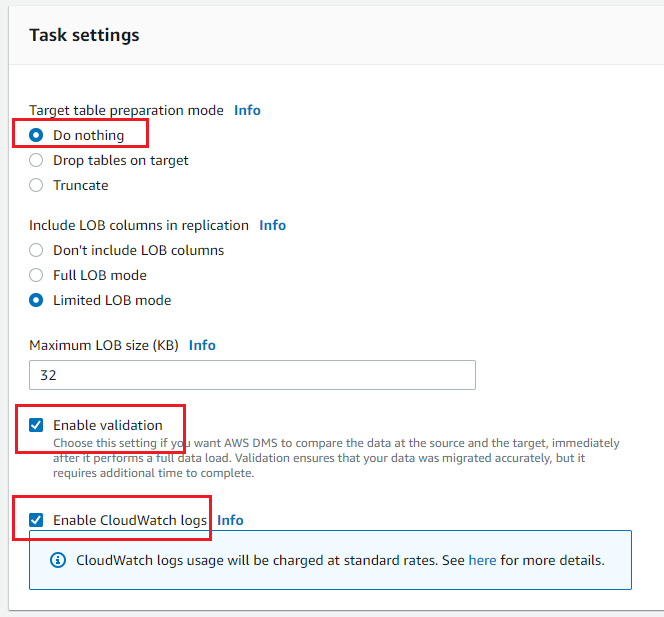

 6. Under Table Mapping section, enter as below:
  - choose **JSON Editor** and copy & paste the following mapping code.
  
      ```json
      {
      "rules": [
        {
          "rule-type": "transformation",
          "rule-id": "1",
          "rule-name": "1",
          "rule-target": "schema",
          "object-locator": {
            "schema-name": "TAXI",
            "table-name": "%"
          },
          "rule-action": "convert-lowercase"
        },
        {
          "rule-type": "transformation",
          "rule-id": "2",
          "rule-name": "2",
          "rule-target": "table",
          "object-locator": {
            "schema-name": "TAXI",
            "table-name": "%"
          },
          "rule-action": "convert-lowercase"
        },
        {
          "rule-type": "transformation",
          "rule-id": "3",
          "rule-name": "3",
          "rule-target": "schema",
          "object-locator": {
            "schema-name": "TAXI"
          },
          "value": "public",
          "rule-action": "rename"
        },
        {
          "rule-type": "selection",
          "rule-id": "4",
          "rule-name": "4",
          "object-locator": {
            "schema-name": "TAXI",
            "table-name": "DRIVERS"
          },
          "rule-action": "include"
        },
        {
          "rule-type": "selection",
          "rule-id": "5",
          "rule-name": "5",
          "object-locator": {
            "schema-name": "TAXI",
            "table-name": "RIDERS"
          },
          "rule-action": "include"
        },
        {
          "rule-type": "selection",
          "rule-id": "6",
          "rule-name": "6",
          "object-locator": {
            "schema-name": "TAXI",
            "table-name": "BILLING"
          },
          "rule-action": "include"
        },
        {
          "rule-type": "selection",
          "rule-id": "7",
          "rule-name": "7",
          "object-locator": {
            "schema-name": "TAXI",
            "table-name": "PAYMENT"
          },
          "rule-action": "include"
        },
        {
          "rule-type": "transformation",
          "rule-id": "8",
          "rule-name": "8",
          "rule-target": "column",
          "object-locator": {
            "schema-name": "TAXI",
            "table-name": "%",
            "column-name": "%"
          },
          "rule-action": "convert-lowercase"
        }
      ]
    }
      ```
   
> **_NOTE:_** As part of the migration task, we have created the above mapping rule to include tables that are related to Payment and Billing use case only. DMS provides rich set of selection and transformation rules for migration (e.g. selecting specific tables, remove column, define primary key etc.). For this lab, we will convert the source schema, table and column names to lower case, and rename the schema owner from taxi to public in Aurora PostgreSQL database. Please refer to [DMS](https://docs.aws.amazon.com/dms/latest/userguide/CHAP_Tasks.CustomizingTasks.TableMapping.html) documentation to learn more.


  

 7. Do not modify anything in the Advanced settings.

 8. Click **Create task**. The task will begin immediately. If the task is not started, start the task manually (Select the task, Click Actions and then Start/Restart task).

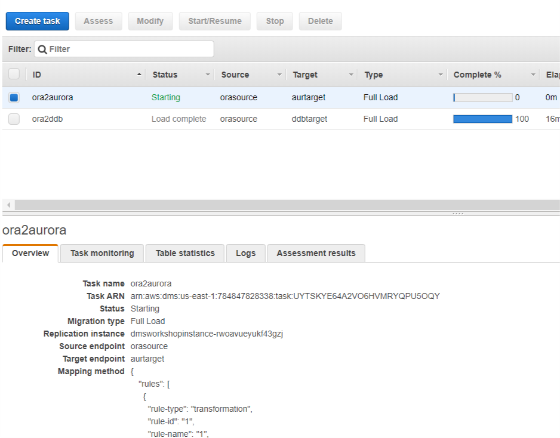 

### Monitoring Replication Task for Aurora PostgreSQL

1. Go to **Data Migration tasks** and Click the task name and look at the **Table Statistics** tab.

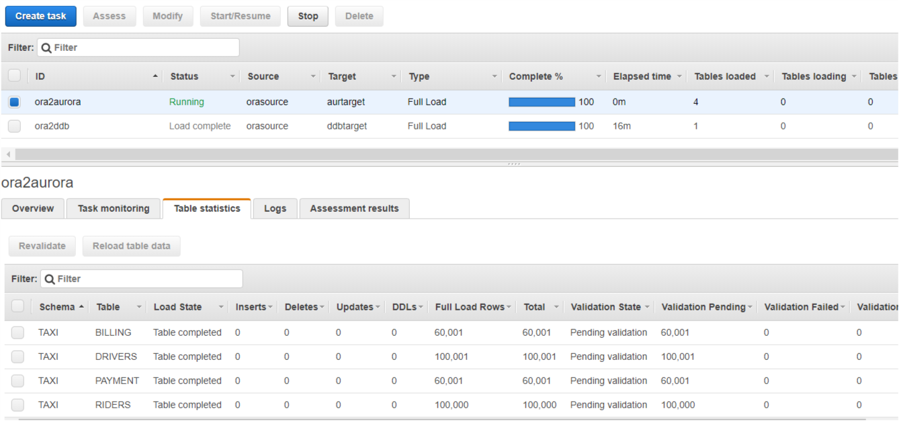

2. You can also review the replication task details in CloudWatch Logs.

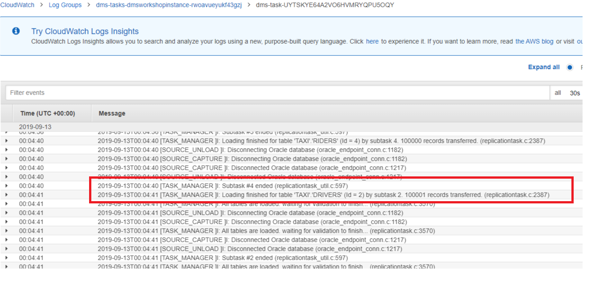


## Final Validation of DMS Tasks

 Please check if both the DMS tasks are completed. You will see the below output.

1. **ora2ddb** task status as "Load Completed". TRIPS table full load row count as 128,714

2. **ora2aur** task status as "Load Completed". Table and Full load count should be: DRIVERS (Count-100,001), PAYMENT (Count-60,001), BILLING (Count -60,001), RIDERS (Count-100,000) 

**Congrats!!** You have successfully completed Lab 1. Now you can proceed to [Lab 2](../lab2-TaxiBookingAndPayments/). 